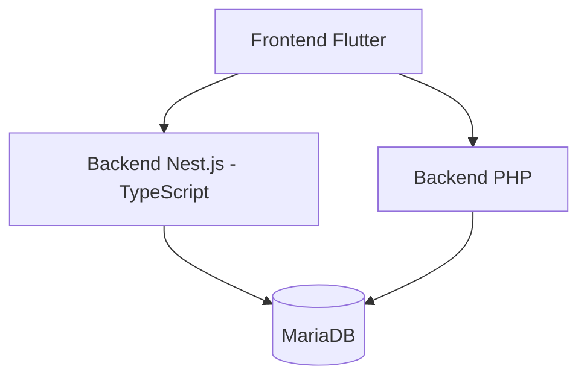

## Architecture of the EconyLand project

### Design

#### Overview: 
Short Overview

```mermaid
graph TD
    FE[Frontend Flutter] --> B1[Backend Next.js - TypeScript]
    FE[Frontend Flutter] --> B2[Backend PHP]

    B1[Backend Nest.js - TypeScript] --> SQL1[(MariaDB)]
    B2[Backend PHP] --> SQL1[(MariaDB)]
```
